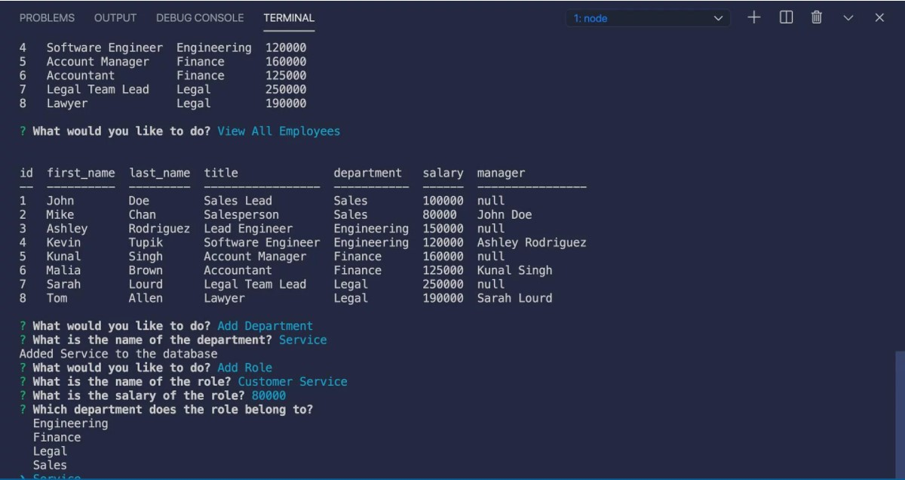

# employee-tracker

## Description
This is a Employee Tracker application that allows a company to view and manage the departments, roles and employees in their database.

## Function

This application allows a company to enter their database to view and modify their companys employees, departments, salary, titles and roles.  After typing in npm start from the command line it will ask a series of prompts to the user.  You can view, departments, roles and employees, you can also add a role, a department, an employee and their salaries. It will then save it in the database and allow you to view it anytime by typing npm start from the command line.

## Credits

I would like to give credit to my Varsity Tutor for taking the time to help me understand use MySQL2, inquirer and the functions of the employeer tracker application.

## Table of Contents

[Description](#description)

[Study-Material](#Study-Material)

[Features](#features)

[Links](#links)

[Repository](https://github.com/jmoniz155/employee-tracker)

[Demo-Video](https://watch.screencastify.com/v/OEdfoUpx34shqFaHZGnS)

## Study-Material

[Mysql2](https://www.npmjs.com/package/mysql2)

[Inquirer](https://www.npmjs.com/package/inquirer)

[Mysql2 Installation Guide](https://coding-boot-camp.github.io/full-stack/mysql/mysql-installation-guide)

[NodeJs](https://www.google.com/search?q=mysql+-u+root+-p&rlz=1C1ASVC_enUS967US967&sxsrf=AOaemvLrTJT2CHxL-_KJLeViMlGfn1MKLw%3A1635299497241&ei=qbB4YdyYDr-q0PEPmqK-yAU&oq=mysql+)

[Mysql2 Creating Tables](https://dev.mysql.com/doc/refman/8.0/en/creating-tables.html)

[Mysql2 Join](https://dev.mysql.com/doc/refman/8.0/en/join.html)

## Features

This app was built using MySql2, Node, javascript and Inquirer package.

## Links

[Repository](https://github.com/jmoniz155/employee-tracker)

[Demo-Video](https://watch.screencastify.com/v/OEdfoUpx34shqFaHZGnS)

